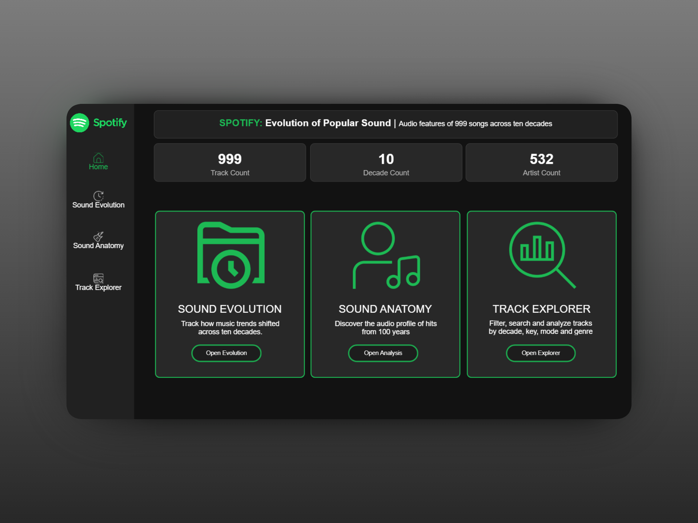
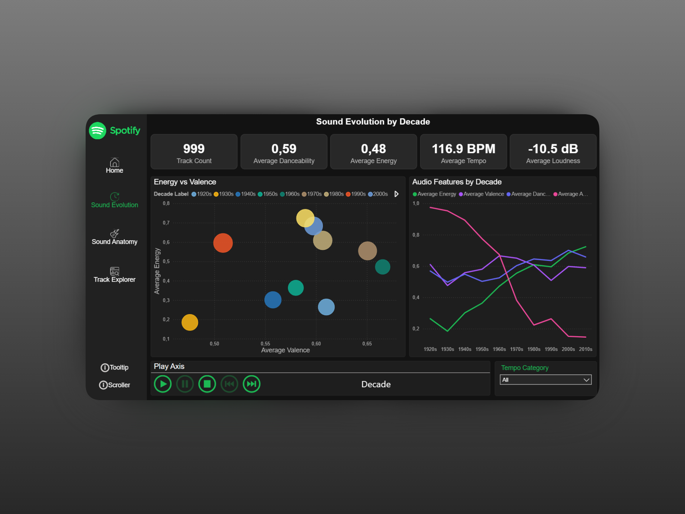
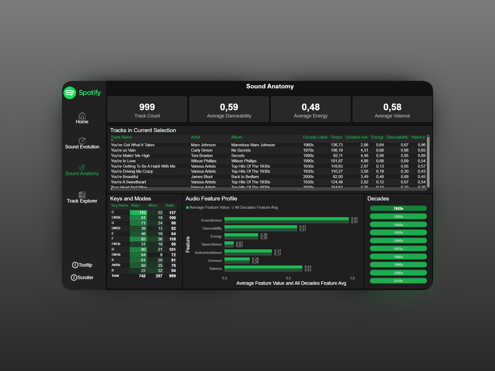
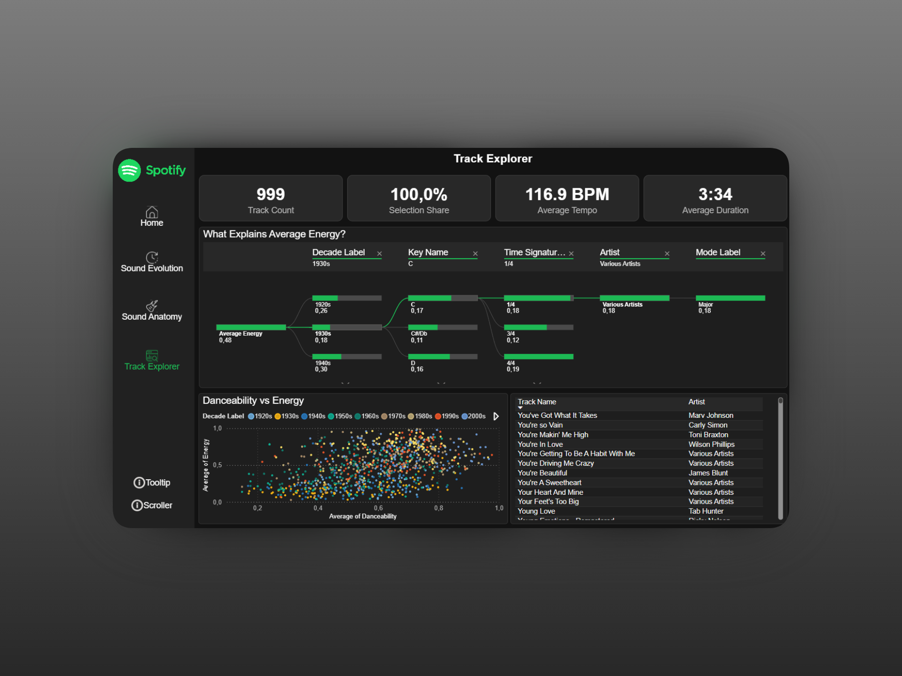

# Spotify-Analytics-BI-Dashboard

<div align="center">
  
</div>

## Project Overview
This repository contains the final project for the Business Intelligence Tools Design course. We built a comprehensive BI dashboard analyzing music streaming data and user listening habits. The project translates complex, raw streaming metrics into an interactive, visually engaging, and dark-themed experience that closely mirrors the Spotify brand aesthetic.

<div align="center">
  
</div>

## The Team
This dashboard was developed collaboratively by a cross-functional team:
* **Alicja Świercz (@alicjaswiers)** – **UI/UX Design.** Led the visual direction of the project. Responsible for the dark-mode aesthetic, custom iconography, layout structure, integration of advanced custom slicers, and ensuring a highly intuitive user experience.
* **Łukasz Jęcek (@lukaszjecek)** – **Backend & Data Architecture.** Managed data extraction, data cleansing, relational modeling, and wrote the core DAX measures powering the metrics.
* **Ireneusz Bartoszek (@bartoszir)** – **Data Engineering & Analytics.** Collaborated on backend development, DAX calculations, and the overall logic connecting the data model with the frontend visuals.

## Objectives & Key Features
* **User Behavior Tracking:** Analyzing top artists, favorite genres, and listening trends over time.
* **Thematic UI/UX:** A fully custom, dark-mode interface utilizing Spotify-branded assets and carefully chosen color palettes for high contrast and readability.
* **Advanced Navigation:** Implementation of non-standard visual slicers (e.g., `Chip Slicer Pro`, `Filter By List`) to elevate the filtering experience beyond default Power BI capabilities.
* **Dynamic Interactivity:** Smooth cross-filtering, custom tooltips, and clear visual hierarchy guiding the user through the data story.

<div align="center">
  
</div>

## Technologies Used
* **BI Tool:** Power BI Desktop
* **Skills:** UI/UX Design, Data Modeling, DAX, Custom Visuals Integration, Data Transformation.

<div align="center">
  
</div>

## How to Run Locally
1. Clone this repository: 
   ```bash
   git clone [https://github.com/alicjaswiers/Spotify-Analytics-BI-Dashboard.git](https://github.com/alicjaswiers/Spotify-Analytics-BI-Dashboard.git)
   ```
2. Navigate to the project directory.
3. Open the `Spotify_Analytics_Dashboard.pbix` file using [Power BI Desktop](https://powerbi.microsoft.com/desktop/).
4. Interact with the visuals to explore the data!

## About the Data
The dashboard is powered by the **[10400 Classic Hits (10 Genres, 1923-2023)](https://www.kaggle.com/datasets/thebumpkin/10400-classic-hits-10-genres-1923-to-2023)** dataset, sourced from Kaggle. 

This rich dataset contains comprehensive audio features (such as acousticness, danceability, energy, and tempo) and metadata for over 10,000 tracks spanning an entire century. It provides a solid foundation for exploring the evolution of music, genre characteristics, and listening trends over time.

> **Note:** To keep the repository lightweight, only a structural sample of the data (`/data/spotify_hits_sample.csv`) is included here. The full dataset can be downloaded directly from the Kaggle link above.

### Data Dictionary
Below is a description of the key columns available in the dataset, representing standard Spotify audio features:

| Column | Description |
|---|---|
| **Track ID** | Unique Spotify identifier for the track. |
| **Artists** | The name of the artist(s) who performed the track. |
| **Track Name** | The title of the song. |
| **Popularity** | A score from 0 to 100 indicating the track's popularity based on recent streams. |
| **Genre** | The musical genre associated with the track. |
| **Danceability** | A value from 0.0 to 1.0 describing how suitable a track is for dancing based on tempo, rhythm stability, beat strength, and overall regularity. |
| **Energy** | A measure from 0.0 to 1.0 representing a perceptual measure of intensity and activity. |
| **Valence** | A measure from 0.0 to 1.0 describing the musical positiveness conveyed by a track (high valence sounds more positive or happy). |
| **Acousticness** | A confidence measure from 0.0 to 1.0 of whether the track is acoustic. |
| **Tempo** | The overall estimated tempo of a track in beats per minute (BPM). |
| **Duration (ms)** | The length of the track in milliseconds. |